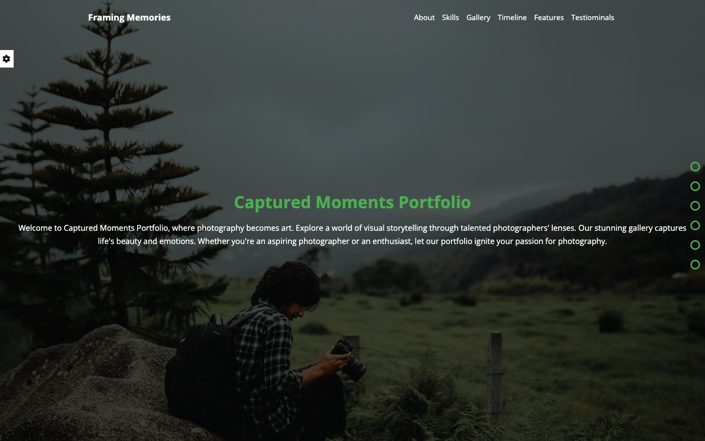

# Framing Memories

An interactive photography portfolio built with HTML, CSS, and vanilla JavaScript. Framing Memories combines a responsive editorial layout with user-controlled themes, rotating hero imagery, an image lightbox, animated skill indicators, timeline content, and persistent display preferences.

[View the live portfolio](https://mohamedmosilhy.github.io/Photographer-portfolio/) · [View the source](https://github.com/mohamedmosilhy/Photographer-portfolio)



## Features

- Configurable accent-color themes
- Optional hero background rotation every ten seconds
- Theme, background, and navigation-bullet preferences saved in `localStorage`
- Settings panel with a one-click preference reset
- Skill bars animated when the section enters the viewport
- Gallery images displayed in a generated modal overlay
- Smooth navigation from header links and section bullets
- Timeline covering photography milestones
- Services/features and testimonial sections
- Responsive mobile navigation menu
- Contact form presentation

## Page sections

The portfolio includes a landing area, About Us, Our Skills, Gallery, Timeline, Features, Testimonials, and Contact Us. Navigation links and optional side bullets provide direct access to each main section.

The contact form is currently visual only; it is not connected to a form-processing service.

## Built with

- HTML5
- CSS3
- JavaScript
- Web Storage API
- DOM and scroll events
- CSS custom properties
- Font Awesome
- Google Fonts

## Project structure

```text
Photographer-portfolio/
├── css/
│   ├── normalize.css
│   ├── all.min.css
│   └── master.css
├── imgs/          # Hero, gallery, client, and section images
├── js/
│   └── master.js  # Settings, persistence, navigation, and gallery behavior
├── webfonts/
├── index.html
└── README.md
```

## Run locally

```bash
git clone https://github.com/mohamedmosilhy/Photographer-portfolio.git
cd Photographer-portfolio
```

Open `index.html` directly or serve the folder with a static web server. No package installation is required.

## Interaction details

- Selecting a color updates the global `--main-color` CSS variable.
- Enabling random backgrounds cycles through the local hero photographs.
- Clicking a gallery image creates an overlay and an enlarged image panel.
- The Reset Options control clears saved display settings and reloads the page.

These behaviors are implemented directly in `js/master.js` without external JavaScript libraries.
